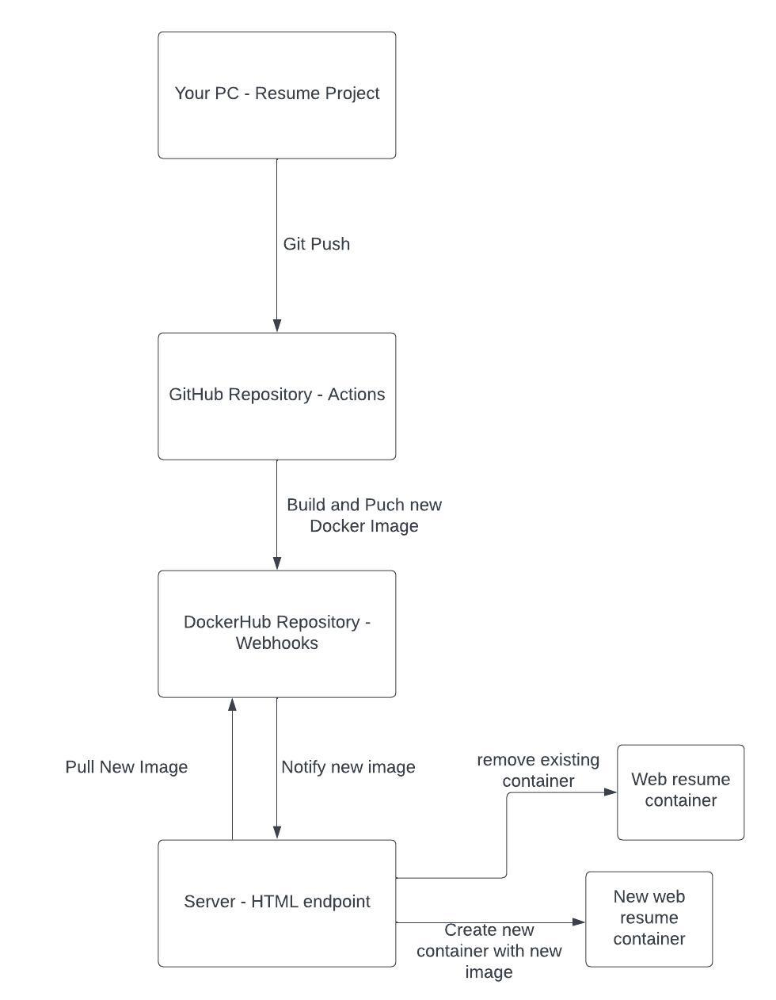

# Project 5
## Part 1
### Documentation
- The purpose of this project is to implement semantic versioning for docker images using git tag metadata in in Actions. We also use webhooks to keep the enviorment up to date. Tools used are GitHub Actions, Dockerm Git, DockerHub and webhooks.
- Use the following command to tag: git tag -a v1.0.0 -m "Version 1.0.0" . Then use: git push origin v1.0.0, to push it to the remote repository.
- When the GitHub workflow is triggered by a git push before amended changes. it consists of the following steps. Checkout code, logs in to docker, and Build and push docker image. Ot also runs when a tag is pushed, uses docker metadata to generate tags and push images to DockerHub.
- https://hub.docker.com/repository/docker/phillipn117/project4/general

## Part 2
### Documentation
- To install Docker run the command sudo apt-install docker.io
- Then you can use sudo snap install docker to get all dependency packages. Then check version with docker --version. 
- Automates the process of pulling a new Docker image from DockerHub and restarting the container on an EC2 instance.
- home/ubuntu/deployment
- First install go and git if not already installed.
- clone the adnanh Webhook repository. Then cd into webhook directory and use go build.
- To start webhook, use the following command: ./webhook -hooks /path/to/hooks.json -verbose
- To address instance reboot, create a webhook service file. 
- A webhook file defines the configuration of a ECS that will recieve HTTP requests from an external source.
- the webhook file should be located in a directory where the task runner or container reads the config files.
- You need to set up a webhook that sends an HTTP Post request to the URL. On dockerhub, click create webhook and enter the URL of your listener. Then select trigger events and save the webhook.

## Part 3
